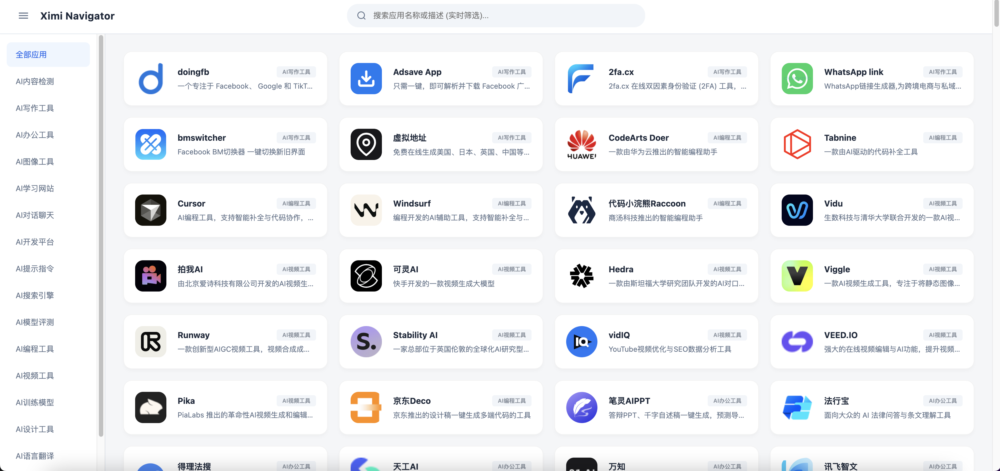
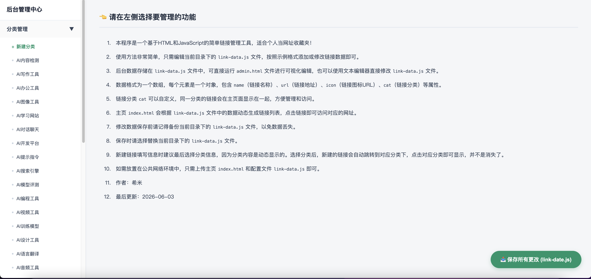

## 前言

 1. 本程序旨在提供一个轻量级本地网址收藏夹，方便集中管理和快速访问常用网站。
 2. 最初使用 HTML + JSON 存储数据，但受浏览器本地安全限制，改为 HTML + JavaScript 配置文件。
 3. 由于前端 JavaScript 在本地环境中无法直接修改文件，因此采用了一种折中的方法：
 4. 读取现有配置数据并进行可视化编辑； 保存时自动生成新的配置文件； 用户手动替换原有配置文件即可完成数据更新。
 5. 这种方式无需数据库、无需服务器，也无需安装任何额外环境，下载后即可离线使用。
 6. 如需部署到公网，只需上传新的配置文件，或根据需要开发后台实现在线管理。
 7. 本项目追求简单、开箱即用，适合个人网址整理。

 ## 预览
  - 网址1: https://link.hhqq.net/
  
  - 前台:
   

  - 后台:
   

 ## 说明 

1. 本程序是一个基于HTML和JavaScript的简单链接管理工具，适合个人当网址收藏夹!
2. 使用方法非常简单,只需编辑当前目录下的link-data.js文件,按照示例格式添加或修改链接数据即可。
3. 后台数据存储在link-data.js文件中,可直接运行admin.html文件进行可视化编辑,也可以使用文本编辑器直接修改link-data.js文件。
4. 数据格式为一个数组,每个元素是一个对象,包含name(链接名称),url(链接地址),icon(链接图标URL),cat(链接分类)等属性。
5. 链接分类cat可以自定义,同一分类的链接会在主页面显示在一起,方便管理和访问。
6. 主页index.html会根据link-data.js文件中的数据动态生成链接列表,点击链接即可访问对应的网址。
7. 修改数据保存前请记得备份当前目录下link-data.js文件哦,以免数据丢失。
8. 保存时请选择替换当前目录下link-data.js文件
9. 新建链接时候填写信息时候建议最后选择分类信息,因为是动态显示分类下的信息,选择分类后新建的链接会自动跳转到对应分类下,点击对应分类会显示出来,并不是消失了!
10. 如需放置在公共网络环境中,只需放置主页index.html和配置link-data.js文件即可。

## 更新

### 版本:v1.02
1. 支持密码访问,加强隐私保护,数据加密保存,可避免被恶意软件扫描！
2. 密码使用md5方式保存,
3. 数据内容用户可选 使用`明文`,`base64编码`,`AES`等方式保存;
4. 选择使用`明文`,`base64编码`,等方式保存,访问无需密码;
5. `AES`加密默认访问密码`www.ximi.me`;
6. v1.02版本新增2个js库文件请勿删除,crypto-js.min.js,md5.js;

 ## 关于

1. 版本：v1.02 
2. 作者:希米
3. 原文：https://www.ximi.me/post-6040.html
4. 更新时间：2036-06-07
